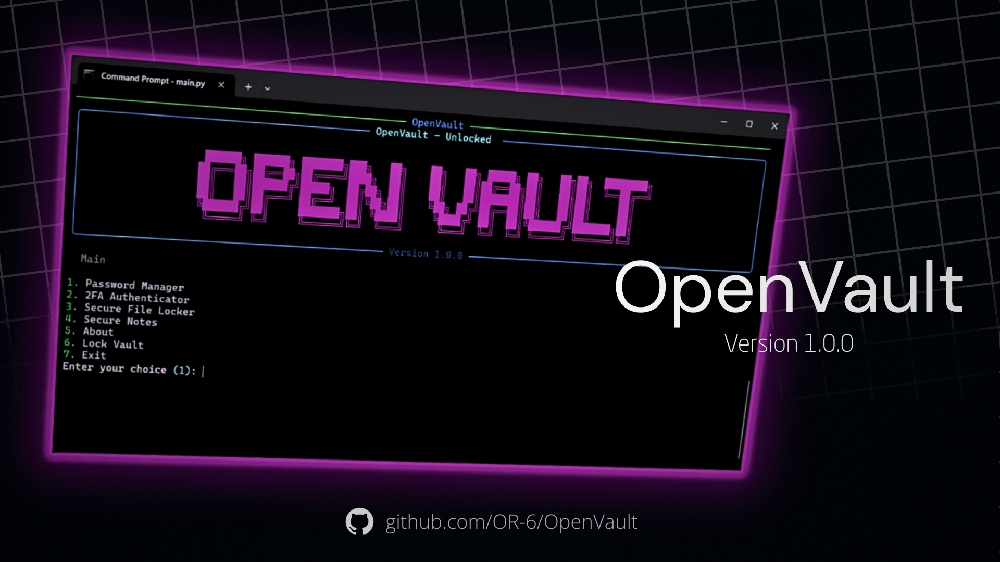

[](https://github.com/OR-6/OpenVault/archive/refs/tags/v1.0.0-beta.0.zip)

# OpenVault

[](https://github.com/OR-6/OpenVault/releases)
[](LICENSE)
[](#)
[](#)

A secure, offline-first password manager, 2FA authenticator, secure file locker, and encrypted notes application — all running in your terminal with a modern, advanced interface.

---

## About

**OpenVault** is designed to store your sensitive information locally with strong encryption and provide an easy-to-use, text-based interface.  
It supports storing:
- Passwords with categories
- TOTP 2FA secrets (manual entry, QR import from image, QR scan via webcam)
- Encrypted file storage
- Encrypted notes

Your vault is **fully encrypted** with a master password using industry-standard algorithms. No cloud sync or external storage is involved — your data stays in your control.

---

## Key Features

- **Password Manager**: Add, view, edit, delete, and categorize passwords.  
- **2FA Authenticator**:
  - Manual secret entry or `otpauth://` URI parsing
  - Import QR codes from image files
  - Live webcam scanning (OpenCV + pyzbar)
  - Auto-detect algorithm, digits, and period
  - Live OTP display with countdown
- **Secure File Locker**:
  - Encrypt and store files locally
  - Decrypt and open files temporarily
  - Supports large files with progress display
- **Secure Notes**: Encrypted note storage with category support
- **Advanced UI**:
  - Rich CLI interface with banners, tables, and panels
  - Clipboard auto-clear after timed copy
  - Categorization for easy organization
- **Local-first Security**:
  - No network connectivity required
  - Data encrypted with your master password

---

## Installation

### Clone the repository
```bash
git clone https://github.com/OR-6/OpenVault.git
cd OpenVault
```

### Install dependencies

```bash
pip install -r requirements.txt
```

For QR scanning via webcam:

```bash
pip install opencv-python pyzbar Pillow
```

---

## Usage

Run the application:

```bash
python main.py
```

First run will prompt you to create a master password and set up your vault.
Navigation is via numbered menus.

---

## Requirements

* **Python**: 3.9+
* **Core Dependencies**:

  * `rich`
  * `cryptography`
  * `pyotp`
  * `pyperclip`
  * `qrcode`
* **Optional for QR/Webcam**:

  * `opencv-python`
  * `pyzbar`
  * `Pillow`

---

## Security Notes

* **Master Password**: Do not forget it — there is no recovery mechanism.
* **Temporary Files**: Decrypted files are stored in a temporary directory; remove them when done.
* **Clipboard**: Copied passwords/OTP codes are cleared automatically after a short delay.

---

## License

This project is licensed under the [MIT License](LICENSE).

---

## Links

* **Releases**: [Latest Release](https://github.com/OR-6/OpenVault/releases)
* **Source Code**: [GitHub Repository](https://github.com/OR-6/OpenVault)
